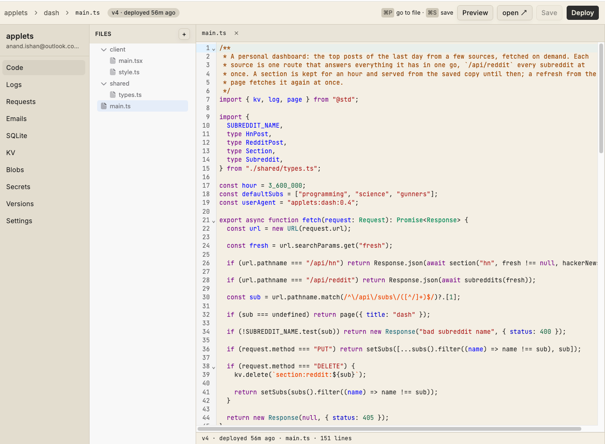

# Applets

A personal [Val Town](https://www.val.town/) clone on Cloudflare Workers, for one admin and the family and friends they let in.

You write a small javascript program (or get your agent to do it), press Deploy in the editor, and it is live on its own hostname with its own database, its own email inbox, schedules, logs and so on.

Most features are copied from Val-town, save the sharing features and the actual implementation.
- Applets are small JS apps that can range from a simple http endpoint to a full stack app with npm imports.
- Each applet gets its own sql database, a blob store, email inbox. 
- Comes with an MCP server, so you don't really need to use the editor. Coding agents are great at writing small applets.

**NOTE**: This is a fully vibe coded product, with almost no code written by hand. But iterated on heavily to keep the code in a shape I can comprehend. 

# Why Cloudflare

It is an all-in-one cloud, and I love a small dependency stack. One Cloudflare Computer Workers subscription is sufficient to host the entire thing.

- Cloudflare workers provide cheap, convenient isolation. So each applet can be executed safely in isolation.
- Email service, Blob storage (R2), Databases (D1) are all built in primitives on CF.
- [Durable object Facets](https://developers.cloudflare.com/dynamic-workers/usage/durable-object-facets/) give us an isolated sqlite database per app, without having to provision top level databases separately for each app.

We also triedd using [celld](https://celld.dev/) which gives you a local CF compatible setup, but database queries/workers often ended up stalling. Eager to try again once it is more mature.

A limitation is that you're limited to the JS/TS stack but that's pretty sufficient for mini apps. [Exe.dev](https://exe.dev/docs/what-is-exe) is the product to go for if you want a more general set-up; it gives you full persistent VMs for each app. So you can pretty much run anything there.

## Topology

- Cloudflare Workers runs the code. The account needs Workers Paid, because the Worker Loader and Durable Object facets do
- three workers are the platform: the router owns ingress, sign-in, the access policy, the admin API, the MCP server and one supervisor per applet; the bundler turns applet source into a worker module; the editor is a page that creates, edits, deploys and manages applets from a browser. On the account they are named `applets-router`, `applets-bundler` and `applets-editor`
- every applet is a row in the registry, loaded at request time with the Worker Loader and run as a Durable Object facet with its own SQLite
- one deployment is one group of people. The admin adds an email and that person can sign in, make applets and set each one to `private`, `family` or `public`. Code, logs and settings belong to the applet's owner alone
- applets are made in the editor, or by an agent over the MCP server, which any MCP client adds with one URL and signs into with OAuth. The repo's own scripts only run and deploy the platform, and push the example applets
- an `@std` library gives every applet SQLite, key-value storage, blobs, email, AI chat completions, logging and a page shell with no setup
- `wrangler` deploys the platform and runs all of it locally

Deploying an applet needs no toolchain on the host at all.

# Docs

Beyond this file: [docs/applets.md](docs/applets.md) is how to write an applet, [docs/platform.md](docs/platform.md) is how to use a deployment, [docs/development.md](docs/development.md) is how to develop and deploy the platform, and [docs/architecture.md](docs/architecture.md) is how the platform is built and why.
